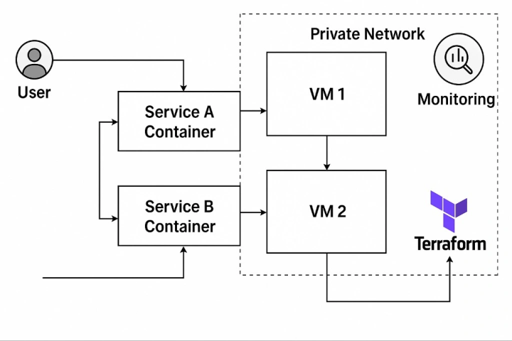

# Multi-Service Application Deployment Pipeline

## Project Overview

This project demonstrates a complete CI/CD pipeline for a simple Python-based multi-service application. It showcases containerization, infrastructure automation using IaC, automated testing, and a GitLab-driven deployment workflow.

### Key Components:
- **Service A**: A Python API to store and retrieve user data.
- **Service B**: A Python service that processes data received from Service A.
- **CI/CD**: GitLab pipeline handling build, test, scan, and deploy.
- **IaC**: Infrastructure setup using Terraform and shell scripts.
- **Containerization**: Docker and Docker Compose.

---

## Architecture Diagram


---

## CI/CD Pipeline Diagram



---

## Container Architecture

### Docker Compose Setup:
```yaml
version: '3'
services:
 service_a:
 build: ./service_a
 ports:
 - "5000:5000"
 networks:
 - app-network

 service_b:
 build: ./service_b
 ports:
 - "6000:6000"
 networks:
 - app-network
 depends_on:
 - service_a

networks:
 app-network:
 driver: bridge

Each microservice has its own Dockerfile and runs in an isolated container. service_b depends on service_a for data input.
```

---

### Infrastructure as Code (IaC)

Terraform Responsibilities:

Provision 2 Virtual Machines

Set up private networking

Enable basic monitoring (e.g., using Prometheus/Node Exporter)

Output public IPs

---

### Bash Script:

Used for initial server configuration: install Docker, Docker Compose, Git, and other required packages.
```bash
#!/bin/bash
sudo apt update && sudo apt install -y docker.io docker-compose git
sudo systemctl enable docker
```
---

### GitLab CI/CD Pipeline (.gitlab-ci.yml)
```yaml
stages:
  - build
  - test
  - deploy

build:
  stage: build
  script:
    - docker build -t service_a ./service_a
    - docker build -t service_b ./service_b

test:
  stage: test
  script:
    - cd service_a && python -m pytest
    - cd service_b && python -m pytest

deploy:
  stage: deploy
  script:
    - echo "Deploying Service A to $SERVICE_A_IP..."
    - scp -o StrictHostKeyChecking=no -r ./service_a ubuntu@$SERVICE_A_IP:~/service_a
    - ssh -o StrictHostKeyChecking=no ubuntu@$SERVICE_A_IP "cd service_a && docker-compose up -d --build"
    - echo "Deploying Service B to $SERVICE_B_IP..."
    - scp -r ./service_b ubuntu@$SERVICE_B_IP:~/service_b
    - ssh ubuntu@$SERVICE_B_IP "cd service_b && docker-compose up -d --build"
```
---

### Version Control Strategy

Main: Production-ready code

Dev: Staging and testing

Feature branches: For each microservice or major change


---

### Setup Instructions

Prerequisites:

Terraform & AWS CLI installed

GitLab account

SSH access to VMs


Steps:

1. Clone the repo:
```bash
git clone https://github.com/Abdulmonaim-Medhat/multi-service-devops-project.git
cd multi-service-devops-project
```

2. Initialize infrastructure:
```bash
cd infra
terraform init
terraform apply
```

3. Configure and deploy:
```bash
bash infra/setup.sh
git push origin dev
```


---

### Deployment Process

- Developer pushes code to dev

- GitLab triggers pipeline:

- Builds Docker images

- Runs unit tests

- Deploys to VMs via SSH

- Final merge to main for production release


---

### Challenges & Solutions

Challenge Solution

- VM provisioning delays Used pre-defined Terraform modules
- Pipeline failing on dependencies Used depends_on and retry logic

